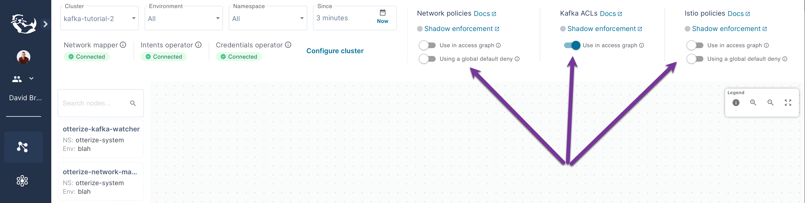
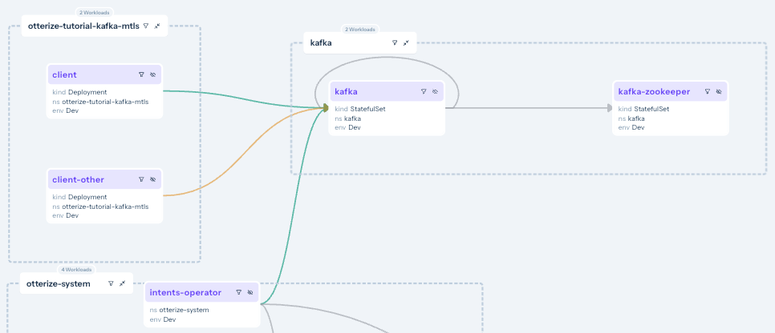

import Tabs from '@theme/Tabs';
import TabItem from '@theme/TabItem';

This tutorial will walk you through declaring and applying intents to easily secure access to Kafka running inside a Kubernetes cluster,
automating the management of Kafka ACLs, and the generation and deployment of certificates for mTLS between Kafka and its clients.

In this tutorial, we will:

- Deploy a Kafka broker with 2 topics, and two clients that call these topics.
- Protect just 1 of those topics with Otterize. See that access to that topic is blocked.
- Declare that one client pod intends to access that protected topic.
- See that an ACL was autogenerated to allow just that, while blocking calls to that topic from the other client.
- Also verify that mTLS credentials were autogenerated for all clients.

## Prerequisites

<details>
<summary>Prepare a Kubernetes cluster</summary>

Before you start, you'll need a Kubernetes cluster.

{@include: ../_common/cluster-setup.md}
</details>

You can now install (or reinstall) Otterize in your cluster, and optionally connect to Otterize Cloud. Connecting to Cloud lets you:
1. See what's happening visually in your browser, through the "access graph";
2. Avoid using SPIRE (which can be installed with Otterize) for issuing certificates, as Otterize Cloud provides a certificate service.

So either forego browser visualization and:

<details>
<summary>Install Otterize in your cluster, <b>without</b> Otterize Cloud (and no network policy management)</summary>

{@include: ../_common/install-otterize-kafka.md}

</details>

Or choose to include browser visualization and:

<details>

:::note
For this tutorial, we'll configure Otterize to not manage network policies, so we can focus on topic-level Kafka ACL authorization (vs just accessing Kafka at all).

Of course you can also choose to combine them &mdash; after all, Kafka is just another service running in the cluster. To do that, reinstall Otterize without the **`--set intentsOperator.operator.enableNetworkPolicyCreation=false`** flag.
:::

<summary>Install Otterize in your cluster, <b>with</b> Otterize Cloud (and no network policy management)</summary>

#### Create an Otterize Cloud account

{@include: ../_common/create-account.md}

#### Install Otterize OSS, connected to Otterize Cloud

{@include: ../_common/install-otterize-from-cloud-with-enforcement-and-kafka-watcher.md}
Make sure you also include the **`--set intentsOperator.operator.enableNetworkPolicyCreation=false`** flag. as well.
</details>

## Install Kafka

We will deploy a Kafka broker using Bitnami's [Helm chart](https://github.com/bitnami/charts/tree/master/bitnami/kafka).
In the chart we will configure Kafka to:
- Recognize the Otterize intents operator as a super user so it can configure ACLs;
- Use TLS (Kafka calls it SSL) for its listeners;
- Tell the Otterize credentials operator, via pod annotations, how credentials should be created;
- Authenticate clients using mTLS credentials provided as a Kubernetes secret; and
- Allow access to any topic by default unless denied by an ACL.

<details>
<summary>Expand to see the Helm values.yaml used with the Bitnami chart</summary>

```yaml
{@include: ../../static/code-examples/kafka-mtls/helm/values.yaml}
```
</details>

The following command will deploy a Kafka broker with this chart:
 ```bash
 helm repo add bitnami https://charts.bitnami.com/bitnami
 helm repo update
 helm install --create-namespace -n kafka \
   -f https://docs.otterize.com/code-examples/kafka-mtls/helm/values.yaml kafka bitnami/kafka --version 21.4.4
 ```

You can watch for all pods to be `Ready` using `kubectl get pods -n kafka -w`.

<details>
<summary>If you're using Otterize Cloud, adjust your display settings</summary>
You want to make sure that under **Istio Policies** *Use in access graph* is turned off and that under **Network Policies** *Use in access graph* is also turned off.

Turning *Use in access graph* **on** under **Kafka ACLs** will make it clear that we're only looking for the effects of Kafka ACLs, not network policies or Istio policies.


</details>

## Configure Otterize to manage Kafka access

In our simple example, we'll call the Kafka broker service simply "kafka".
Let's connect Otterize to it by applying an Otterize `KafkaServerConfig`, naming it and configuring default access:
```bash
kubectl apply -f https://docs.otterize.com/code-examples/kafka-mtls/kafkaserverconfig.yaml
```
<details>
<summary>Expand to see the KafkaServerConfig</summary>

Our Kafka server will have 2 topics `transactions` and `mytopic` that our clients will be accessing.
<Tabs>

<TabItem value="kafkaserverconfig.yaml" label="kafkaserverconfig.yaml">

```yaml
{@include: ../../static/code-examples/kafka-mtls/kafkaserverconfig.yaml}
```

</TabItem>
</Tabs>
</details>

We've chosen to allow unauthenticated access to both topics to begin with.
This will be the base state, from which we can gradually secure access to specific topics.

## Deploy clients

Our simple example also consists of two client pods:
- One named "**client**".
- And one named "**client-other**".

These clients will authenticate to Kafka using mTLS. Otterize makes this easy, requiring just 3 simple changes to the client pod spec:
1. **Generate credentials**: add the `credentials-operator.otterize.com/tls-secret-name` annotation, which tells Otterize to generate mTLS credentials and store them in a Kubernetes secret whose name is the value of this annotation.
2. **Expose credentials in a volume**: add a volume containing this secret to the pod.
3. **Mount the volume**: mount the volume in every container in the pod.

<details>
<summary>Expand to see this structure</summary>

```yaml
spec:
  template:
    metadata:
      annotations:
        # highlight-next-line
        # 1. Generate credentials as a secret called "client-credentials-secret":
        credentials-operator.otterize.com/tls-secret-name: client-credentials-secret
        ...
    spec:
      volumes:
        # highlight-start
        # 2. Create a volume containing this secret:
        - name: otterize-credentials
          secret:
            secretName: client-credentials-secret
        # highlight-end
        ...
      containers:
        - name: client
          ...
          volumeMounts:
            # highlight-start
            # 3. Mount volume into container
            - name: otterize-credentials
              mountPath: /var/otterize/credentials
              readOnly: true
            # highlight-end
```
</details>

<details>
<summary>Expand to see the client specs used in this example</summary>
<Tabs>

<TabItem value="namespace.yaml" label="namespace.yaml" default>

```yaml
{@include: ../../static/code-examples/kafka-mtls/namespace.yaml}
```

</TabItem>

<TabItem value="client-deployment.yaml" label="client-deployment.yaml">

```yaml
{@include: ../../static/code-examples/kafka-mtls/client-deployment.yaml}
```

</TabItem>

<TabItem value="client-other-deployment.yaml" label="client-other-deployment.yaml">

```yaml
{@include: ../../static/code-examples/kafka-mtls/client-other-deployment.yaml}
```

</TabItem>

</Tabs>
</details>

1. Deploy the two clients into a namespace called `otterize-tutorial-kafka-mtls` using `kubectl`:
```bash
kubectl apply -f https://docs.otterize.com/code-examples/kafka-mtls/all.yaml
```

<details>
<summary>Optional: check deployment status</summary>

Check that the client pods were deployed:

```bash
kubectl get pods -n otterize-tutorial-kafka-mtls
```
You should see:
```
NAME                                    READY   STATUS    RESTARTS   AGE
client-65695dfc4c-jf4hd                 1/1     Running   0          92s
client-other-7c4b8cbd8d-dpkt6           1/1     Running   0          92s
```
</details>

Let's monitor, in separate terminal windows, both clients' attempts to call Kafka,
so we can see the effects of our changes in real time.

2. **Open a new terminal window [client]** and tail the client log:
```bash
kubectl logs -f --tail 1 -n otterize-tutorial-kafka-mtls deploy/client
```
This client should be able to access both topics:
```
[client] Loading mTLS certificates
[client] Connecting to Kafka
[client] Creating a producer and a consumer for - mytopic
[client] Sending Messages
[debug]  [client] Sent message 1 [mytopic]
[client] Creating a producer and a consumer for - transactions
[client] Sending messages
[debug]  [client] Sent message 1 [transactions]
[client] Sent message to topic: transactions - [client] Sent message 1 [transactions]
[client] Sent message to topic: mytopic - [client] Sent message 1 [mytopic]
[client] Read message from topic: mytopic - [client-other] Sent message 27 [mytopic]
[client] Read message from topic: mytopic - [client-other] Sent message 18 [mytopic]
[client] Read message from topic: mytopic - [client] Sent message 2 [mytopic]
[client] Read message from topic: mytopic - [client-other] Sent message 36 [mytopic]
[client] Read message from topic: mytopic - [client-other] Sent message 6 [mytopic]
[client] Read message from topic: mytopic - [client-other] Sent message 33 [mytopic]
[client] Read message from topic: mytopic - [client-other] Sent message 19 [mytopic]
```

As you can see, both `client` and `client-other` are currently able to access both `mytopic` and `transactions` topics.

3. **Open another terminal window [client-other]** and tail the client-other log:
```bash
kubectl logs -f --tail 1 -n otterize-tutorial-kafka-mtls deploy/client-other
```
This other client should also be able to access both topics:
```
[client-other] Loading mTLS certificates
[client-other] Connecting to Kafka
[client-other] Creating a producer and a consumer for - mytopic
[client-other] Sending messages
[client-other] Creating a producer and a consumer for - transactions
[client-other] Sending messages
[debug]  [client-other] Sent message 1 [mytopic]
[debug]  [client-other] Sent message 1 [transactions]
[client-other] Sent message to topic: transactions - [client-other] Sent message 1 [transactions]
[client-other] Sent message to topic: mytopic - [client-other] Sent message 1 [mytopic]
[client-other] Read message from topic: transactions - [client] Sent message 5 [transactions]
```

If you've attached Otterize OSS to Otterize Cloud, you can now browse to your account at [https://app.otterize.com](https://app.otterize.com) and see the access graph for your cluster:


<details>
<summary>Why do I see eight services?</summary>

In addition to the Kafka service and the 3 clients we deployed (yes, we snuck a 3rd client in there), the network mapper also picked up the calls between the intents operator and Kafka, and between Kafka and zookeeper, so those discovered intents are reflected in the access graph (in light blue).

We also deployed the Otterize kafka-watcher to monitor Kafka for new topics and intents, and that watcher communicates with the network-mapper in order to report the discovered intents (in grey).

The access graph also reflects an intent that's already been declared and applied, and was reported by the intents operator to the access graph: it's the intent which the intents operator created for itself to ensure it has access to Kafka. That's [automatically generated](/reference/configuration/intents-operator/configuration) by the intents operator when you apply the KafkaServerConfig: at that point the intents operator knows there is a Kafka service, and in order to ensure it can reach it and configure it, it declares its intent to do so. Specifically that will generate a network policy between the intents operator and the Kafka service, if network policies are in active enforcement and supported by your cluster, so the intents operator doesn't get blocked itself.

:::note
If you're running this tutorial in GKE, you'll also see the `konnectivity-agent` and the `metrics-server` as in the image above.
:::

</details>

<details>
<summary>Optional: tail the logs for client-authenticated</summary>

```bash
kubectl logs -f --tail 1 -n otterize-tutorial-kafka-mtls deploy/client-authenticated
```

```
[client-authenticated] Loading mTLS certificates
[client-authenticated] Connecting to Kafka
[client-authenticated] Creating a producer and a consumer for - mytopic
[client-authenticated] Sending messages
[client-authenticated] Creating a producer and a consumer for - transactions
[client-authenticated] Sending messages
[debug: client-authenticated] Sent message to [mytopic] - [client-authenticated] Sent message 1
[debug: client-authenticated] Sent message to [transactions] - [client-authenticated] Sent message 1

```

</details>

## Apply intents
1. The client declares its intent to call the `kafka.kafka` server with this `intents.yaml` file:

```yaml
{@include: ../../static/code-examples/kafka-mtls/client-intents.yaml}
```
:::tip
Client intents are the cornerstone of [intent-based access control](https://otterize.com/ibac).
:::

2. At this point, since the Kafka server is not actually protected, the `client-other` can still access the topics. But if you look at your Otterize Cloud access graph, you'll see that the connection between the `client` and the Kafka server is now green because we have a declared intent.



3. Now let's make a change to the `kafkaserverconfig` to require intents for the 2 topics.

```bash
kubectl apply -f https://docs.otterize.com/code-examples/kafka-mtls/kafkaserverconfig-intents.yaml
```

Keep an eye on your Otterize Cloud access graph as you do this, as the 2 clients *without* declared intents should turn orange indicating that, if enforcement were turned on, they would be blocked. This is because we changed the KafkaServerConfig to require intents for those topics with `intentRequired: true`:


4. Verify that an ACL for this client was configured on the Kafka broker:
```bash
kubectl logs -n kafka statefulset/kafka | grep "Processing Acl change" | grep mytopic | tail -n 1
```
You should see:
```
[2022-09-13 10:44:52,803] INFO Processing Acl change notification for
ResourcePattern(resourceType=TOPIC, name=mytopic, patternType=LITERAL),
versionedAcls : Set(User:ANONYMOUS has DENY permission for operations:
ALL from hosts: *, User:CN=client.otterize-tutorial-kafka-mtls,O=SPIRE,C=US has ALLOW permission
for operations: ALL from hosts: *), zkVersion : 6 (kafka.security.authorizer.AclAuthorizer)
```

If you've attached Otterize OSS to Otterize Cloud, go back to see the [access graph in your browser](https://app.otterize.com). Click on the Kafka service, and click at the bottom of it to focus on it and show its details:


We can see what happened:
1. Kafka topic-specific intents from **[client]** are declared (solid black inner line and Kafka icon).
2. Calls from **[client-other]** are not declared (missing "white" inner line).
3. Looking at the Kafka service, we can see that **[client]** has specific access configured (via Kafka ACLs) to perform `all` operations on the `mytopic` topic.

Since discovered intents from the network mapper don't specify what specific topics and operations clients are performing (or attempting to perform), the access graph cannot show information on what is being blocked vs allowed (red vs green). That feature is in development.

Also, the access graph shows information about the mTLS certificates (credentials) distributed to the various services, as long as [Cloud-managed credentials](/security#cryptographic-credentials) are being used. Visibility for certificates distributed through an in-cluster SPIRE is in development.

## What did we accomplish?

- Controlling Kafka access no longer means touching ACLs, issuing and managing and distributing certs, establishing trust,
etc.

- As we saw with pod-to-pod access, clients simply declare with their intents files the Kafka access they need,
and define a place on their filesystem where they'll get the appropriate credentials (certs).

- The next `kubectl apply` ensures that all the appropriate certs are issued and distributed,
and that Kafka ACLs are configured to reflect precisely the intended topic-level access.

<details>
<summary>Expand to see what happened behind the scenes</summary>

### One-time setups:

We configured the Helm chart for Kafka to:
* Allow the Otterize intents operator to be a Kafka super user (authenticated with a certificate).
* Use the SSL protocol for the Kafka listeners.
* Let Otterize know it should generate mTLS credentials in the Java Key Store and Java Trust Store formats, and store them as a Kubernetes secret.
* Use mTLS to authenticate clients, using this Kubernetes secret.

We configured Kafka itself to:
* Add the TLS certificates of the Otterize credentials operator.
* Set the default ACL for all topics to allow anonymous access.

### Per-client setups:

We configured each of our clients to:
* Let Otterize know it should generate mTLS credentials for that client.
* Mount the Kubernetes secret in a local volume.

This already enables mTLS authentication between both clients and Kafka.

Then we applied intents:
* We only declared that the *client* pod (not the *client-other* pod) needed to access the `mytopic` topic.

This allowed the *client* pod its access and protected `mytopic` from any unintended access, such as from *client-other*.

</details>

:::tip Bonus tutorial
Try to create an intents file yourself for **client-other**, and apply it to allow this other client to access the topic.
:::

## What's next
- Follow [a more visual tutorial](/quick-visual-tutorials/visual-ibac-kafka-k8s) for securing Kafka with IBAC in a demo ecommerce application.
- Learn how to easily secure pod-to-pod access with IBAC using Kubernetes network policies, in [a hands-on tutorial](/quick-tutorials/k8s-network-policies) or [a more visual tutorial](/quick-visual-tutorials/visual-ibac-network-policies).

## Teardown

:::caution
Take care to remove the intents before removing the KafkaServerConfig or the Kafka broker, as the operator will not know how to remove
the intents if you first make it forget about the Kafka broker or it can't access the broker.
If it's unable to remove the ACLs for the intents, the operator will prevent the intents from being deleted until
it is able to do so.
:::end


To remove the deployed examples run:
```bash
# run this first:
kubectl delete -f https://docs.otterize.com/code-examples/kafka-mtls/client-intents.yaml
# then the rest:
kubectl delete -f https://docs.otterize.com/code-examples/kafka-mtls/all.yaml
kubectl delete -f https://docs.otterize.com/code-examples/kafka-mtls/kafkaserverconfig.yaml
helm uninstall kafka -n kafka
```
