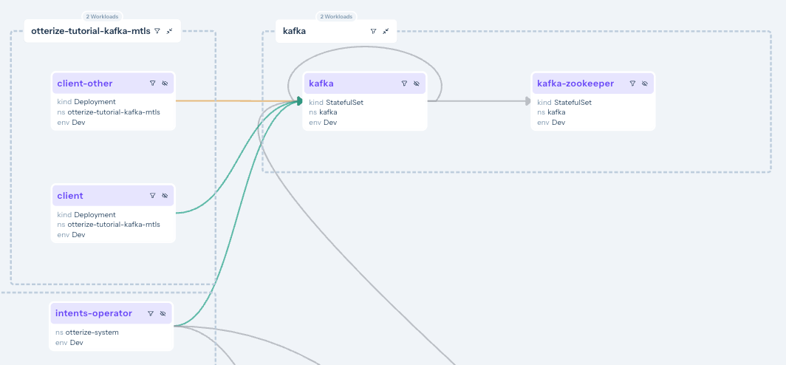
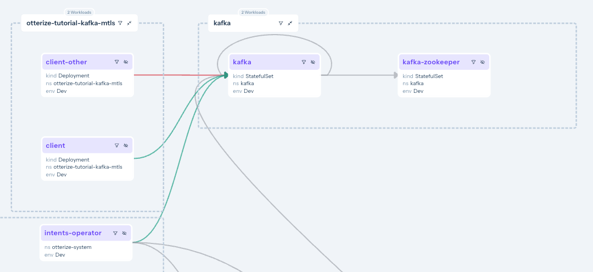

import Tabs from "@theme/Tabs";
import TabItem from "@theme/TabItem";

This tutorial will walk you through declaring and applying intents to easily secure access to Kafka running inside a Kubernetes cluster, automating the management of [Kafka ACLs](https://docs.confluent.io/platform/current/kafka/authorization.html), and the generation and deployment of certificates for mTLS between Kafka and its clients using cert-manager as the certificate provider.

If you prefer to generate certificates using Otterize Cloud, try [the tutorial for Otterize Cloud](/quickstart/access-control/k8s-kafka-mtls).

In this tutorial, we will:

- Deploy Otterize with network policy enforcement disabled to focus on Kafka ACL enforcement
- Set up a CA issuer with cert-manager, and configure Otterize to work with that issuer to issuing service certificates to access Kafka using mTLS.
- Deploy a Kafka broker with 2 topics, and two clients that call these topics.
- Declare that one client pod intends to access one of the topic.
- Enable protection for this Kafka broker.
- See that an ACL was auto-generated to allow just that, while blocking calls to that topic from the other client.

## Prerequisites

### Prepare a Kubernetes cluster

<details>
<summary>Expand for cluster setup instructions</summary>

Before you start, you'll need a Kubernetes cluster.

{@include: ../../_common/cluster-setup.md}

</details>

### Install cert-manager and configure a CA issuer

#### Install cert-manager

Use the following command or [follow cert-manager's installation guide for different setups](https://cert-manager.io/docs/installation/):

```shell
kubectl apply -f https://github.com/cert-manager/cert-manager/releases/download/v1.13.0/cert-manager.yaml
```

#### Set up a CA (Certificate Authority) `ClusterIssuer`

:::caution
This tutorial uses the built-in and easy-to-setup `CA` Issuer type so that the tutorial is easy to run, but you should not use this issuer as-is in production. Instead, consider using one of the other issuers, such as a Venafi or Vault issuer. [Read more about CA issuers in the cert-manager documentation](https://cert-manager.io/docs/configuration/ca/).
:::

```yaml
{@include: ../../../static/code-examples/kafka-mtls-cert-manager/clusterissuer.yaml}
```

Deploy this `ClusterIssuer`:

```shell
kubectl apply -f ${ABSOLUTE_URL}/code-examples/kafka-mtls-cert-manager/clusterissuer.yaml
```

You may have to wait for `cert-manager` to start successfully before you are able to deploy the `ClusterIssuer`.

### Install Otterize

You can now install Otterize in your cluster, and connect to Otterize Cloud. Connecting to Cloud lets you:

1. See what's happening visually in your browser, through the "access graph";
2. Generate certificates using the Otterize Cloud hosted service. If you prefer to generate certificates in-cluster, you can [follow the tutorial for cert-manager](/quickstart/access-control/k8s-kafka-mtls-cert-manager).

<Tabs groupId="otterize-install">

<TabItem value="cloud" label="With the Otterize Cloud access graph">

{@include: ../../_common/install-otterize-from-cloud-with-enforcement-and-kafka-watcher-and-cert-manager.md}

#### Configure the access graph in Otterize Cloud to only show Kafka authorization status

You want to make sure that under **Istio Policies** _Use in access graph_ is turned off and that under **Network Policies** _Use in access graph_ is also turned off.

Keep _Use in access graph_ **on** under **Kafka ACLs** so that the access graph only shows the authorization status for Kafka ACLs.


</TabItem>
<TabItem value="no-cloud" label="Without the Otterize Cloud access graph - open source only">

To install without connecting to Otterize Cloud and no access graph, run the following command:

```shell
helm repo add otterize https://helm.otterize.com
helm repo update

helm upgrade --install otterize otterize/otterize-kubernetes -n otterize-system --create-namespace \
--set intentsOperator.operator.mode=defaultShadow \
--set global.deployment.credentialsOperator=true \
--set global.certificateProvider=cert-manager \
--set credentialsOperator.certManager.issuerName=ca-issuer \
--set intentsOperator.operator.enableNetworkPolicyCreation=false \
--set networkMapper.kafkawatcher.enable=true \
--set networkMapper.kafkawatcher.kafkaServers={"kafka-0.kafka"}
```

</TabItem>
</Tabs>

## Install Kafka

We will deploy a Kafka broker using Bitnami's [Helm chart](https://github.com/bitnami/charts/tree/master/bitnami/kafka).
In the chart we will configure Kafka to:

- Recognize the Otterize intents operator as a super user so it can configure ACLs;
- Use TLS/SSL for its listeners;
- Tell the Otterize credentials operator, via pod annotations, how credentials should be created;
- Authenticate clients using mTLS credentials provided as a Kubernetes secret; and
- Allow access to any topic by default unless denied by an ACL (achieved using `allowEveryoneIfNoAclFound: true`).

<details>
<summary>Expand to see the Helm values.yaml used with the Bitnami chart</summary>

```yaml
{@include: ../../../static/code-examples/kafka-mtls-cert-manager/helm/values.yaml}
```

</details>

The following command will deploy a Kafka broker with this chart:

```bash
helm repo add bitnami https://charts.bitnami.com/bitnami
helm repo update
helm install --create-namespace -n kafka \
  -f ${ABSOLUTE_URL}/code-examples/kafka-mtls-cert-manager/helm/values.yaml kafka bitnami/kafka --version 21.4.4
```

You can watch for all pods to be `Ready` using `kubectl get pods -n kafka -w`.

## Configure Otterize to manage Kafka access

In our simple example, we'll call the Kafka broker service simply "kafka".
Let's tell Otterize how to connect to the Kafka broker by applying an Otterize `KafkaServerConfig`, naming it `kafka`. The name will be the name we later use to declare `ClientIntents`.

```bash
kubectl apply -f ${ABSOLUTE_URL}/code-examples/kafka-mtls-cert-manager/kafkaserverconfig.yaml
```

```yaml
{@include: ../../static/code-examples/kafka-mtls-cert-manager/kafkaserverconfig.yaml}
```

## Deploy clients

Our simple example consists of two client pods:

- One named "**client**".
- And one named "**client-other**".

These clients are connecting to Kafka using mTLS, the credentials which they will receive from Otterize. Otterize makes this easy, requiring just 3 simple changes:

1. **Generate credentials**: add the `credentials-operator.otterize.com/tls-secret-name` annotation, which tells Otterize to generate mTLS credentials and store them in a Kubernetes Secret whose name is the value of this annotation.
2. **Expose credentials in a volume**: add a volume containing this secret to the pod.
3. **Mount the volume**: mount the volume in the pod.

<details>
<summary>Expand to see how to configure a Pod to mount the secret</summary>

```yaml
spec:
  template:
    metadata:
      annotations:
        # highlight-next-line
        # 1. Generate credentials as a secret called "client-credentials-secret":
        credentials-operator.otterize.com/tls-secret-name: client-credentials-secret
        ...
    spec:
      volumes:
        # highlight-start
        # 2. Create a volume containing this secret:
        - name: otterize-credentials
          secret:
            secretName: client-credentials-secret
        # highlight-end
        ...
      containers:
        - name: client
          ...
          volumeMounts:
            # highlight-start
            # 3. Mount volume into container
            - name: otterize-credentials
              mountPath: /var/otterize/credentials
              readOnly: true
            # highlight-end
```

</details>

<details>
<summary>Expand to see the YAML for the pods used in this example</summary>
<Tabs>

<TabItem value="client-deployment.yaml" label="client-deployment.yaml">

```yaml
{@include: ../../../static/code-examples/kafka-mtls-cert-manager/client-deployment.yaml}
```

</TabItem>

<TabItem value="client-other-deployment.yaml" label="client-other-deployment.yaml">

```yaml
{@include: ../../../static/code-examples/kafka-mtls-cert-manager/client-other-deployment.yaml}
```

</TabItem>

</Tabs>
</details>

:::tip
If you prefer, it is possible to avoid using a Secret by using the `cert-manager` [`csi-driver`](https://cert-manager.io/docs/projects/csi-driver/). This requires some manual configuration, but an otterize-csi-driver is coming soon that will require zero configuration.

<details>
    <summary>Expand to learn how to use the cert-manager csi-driver</summary>
Make sure you have set up csi-driver before proceeding.

<br />
Instead of specifying the `credentials-operator.otterize.com/tls-secret-name` pod
annotation and mounting a Secret, you can mount the volume from the CSI driver directly.

Specify the service name for the pod using the pod annotation `intents.otterize.com/service-name`, and then use it in the DNS names with `csi-driver`.

```yaml
kind: Pod
    metadata:
        annotations:
            # highlight-next-line
            intents.otterize.com/service-name: client

[...]
volumes:
    - name: tls
      csi:
        driver: csi.cert-manager.io
        volumeAttributes:
            csi.cert-manager.io/issuer-name: ca-issuer
            # service name from the annotation goes before the pod namespace
            # highlight-next-line
            csi.cert-manager.io/dns-names: client.${POD_NAMESPACE}.svc.cluster.local
```

</details>
:::

1. Deploy the two clients into a namespace called `otterize-tutorial-kafka-mtls` using `kubectl`:

```bash
kubectl apply -f ${ABSOLUTE_URL}/code-examples/kafka-mtls-cert-manager/all.yaml
```

<details>
<summary>Optional: check deployment status</summary>

Check that the client pods were deployed:

```bash
kubectl get pods -n otterize-tutorial-kafka-mtls
```

You should see:

```
NAME                                    READY   STATUS    RESTARTS   AGE
client-65695dfc4c-jf4hd                 1/1     Running   0          92s
client-other-7c4b8cbd8d-dpkt6           1/1     Running   0          92s
```

</details>

Let's monitor, in separate terminal windows, both clients' attempts to call Kafka,
so we can see the effects of our changes in real time.

2. **Open a new terminal window [client]** and tail the client log:

```bash
kubectl logs -f --tail 1 -n otterize-tutorial-kafka-mtls deploy/client
```

This client should be able to access both topics:

```
[client] Loading mTLS certificates
[client] Connecting to Kafka
[client] Creating a producer and a consumer for - mytopic
[client] Sending Messages
[debug]  [client] Sent message 1 [mytopic]
[client] Creating a producer and a consumer for - transactions
[client] Sending messages
[debug]  [client] Sent message 1 [transactions]
[client] Sent message to topic: transactions - [client] Sent message 1 [transactions]
[client] Sent message to topic: mytopic - [client] Sent message 1 [mytopic]
[client] Read message from topic: mytopic - [client-other] Sent message 27 [mytopic]
[client] Read message from topic: mytopic - [client-other] Sent message 18 [mytopic]
[client] Read message from topic: mytopic - [client] Sent message 2 [mytopic]
[client] Read message from topic: mytopic - [client-other] Sent message 36 [mytopic]
[client] Read message from topic: mytopic - [client-other] Sent message 6 [mytopic]
[client] Read message from topic: mytopic - [client-other] Sent message 33 [mytopic]
[client] Read message from topic: mytopic - [client-other] Sent message 19 [mytopic]
```

As you can see, both `client` and `client-other` are currently able to access both `mytopic` and `transactions` topics. (We see `client` sending messages and reading messages sent by `client-other` so we know both are able to access both topics.)

3. **Open another terminal window [client-other]** and tail the client-other log:

This other client should also be able to access both topics:

```bash
kubectl logs -f --tail 1 -n otterize-tutorial-kafka-mtls deploy/client-other
[client-other] Loading mTLS certificates
[client-other] Connecting to Kafka
[client-other] Creating a producer and a consumer for - mytopic
[client-other] Sending messages
[client-other] Creating a producer and a consumer for - transactions
[client-other] Sending messages
[debug]  [client-other] Sent message 1 [mytopic]
[debug]  [client-other] Sent message 1 [transactions]
[client-other] Sent message to topic: transactions - [client-other] Sent message 1 [transactions]
[client-other] Sent message to topic: mytopic - [client-other] Sent message 1 [mytopic]
[client-other] Read message from topic: transactions - [client] Sent message 5 [transactions]
```

You can now browse to your account at [https://app.otterize.com](https://app.otterize.com) and see the access graph for your cluster:


The access graph shows, through its green and orange lines linking the services, that no clients are currently blocked because we haven't enabled any sort of enforcement yet. The orange lines indicate that, since we have not declared any intents for these clients, they _would_ be blocked if we were to turn enforcement on.

## Apply intents

1. The client declares its intent to call the `kafka.kafka` server with this `intents.yaml` file:

```yaml
{@include: ../../../static/code-examples/kafka-mtls-cert-manager/client-intents.yaml}
```

We can apply intents for the `client` by applying the `client-intents.yaml` file:

```bash
kubectl apply -f ${ABSOLUTE_URL}/code-examples/kafka-mtls-cert-manager/client-intents.yaml
```

If you go back to your access graph, you'll now see that the `client` has a solid green line connecting it to the Kafka broker. This is because the `client` has both declared its intent to access the Kafka broker, and it has been authenticated using mTLS.

If you click on that solid line, you will see that the declared intents match the discovered intents, so access is assured.


2. At this point, since the Kafka server is not actually protected, the `client-other` can still access the topics. The line is orange, indicating that it has no declared intents.



We can see what happened:

1. Kafka topic-specific intents from **[client]** are declared (solid green line).
2. Calls from **[client-other]** are not declared (orange line).
3. Looking at the Kafka service, we can see that **[client]** has specific access configured (via Kafka ACLs) to perform `all` operations on the `mytopic` topic.

## Turn on protection

At this point, we haven't actually protected our Kafka broker. From everything we've done so far, we can see, however, that if we were to turn on protection, the `client-other` would lose access to the broker.

Let's see that in action. Our clients that have not declared intents will be blocked from accessing the broker.

We need to turn protection on in for this Kafka broker by declaring it as a protected service:

```yaml
{@include: ../../../static/code-examples/kafka-mtls-cert-manager/protectedservice.yaml}
```

Apply this `ProtectedService` resource:

```shell
kubectl apply -f ${ABSOLUTE_URL}/code-examples/kafka-mtls-cert-manager/protectedservice.yaml
```

If you once again tail the logs for `client-other` you'll see that it is no longer authorized to access this topic:

```
[client-other] Loading mTLS certificates
[client-other] Connecting to Kafka
[client-other] Creating a producer and a consumer for - transactions
[client] Sending messages
[client-other] Creating a producer and a consumer for - transactions
[client] Sending messages
time="[...]" level=error msg="Failed reading/writing to Kafka"
error="kafka server: The client is not authorized to access this topic
```

And if you look back at your access graph, you'll see that the Kafka broker is now protected, and that the `client-other` and `client-authenticated` are blocked.



## What did we accomplish?

- Controlling Kafka access no longer means touching ACLs, issuing and managing and distributing certs, establishing trust,
  etc.

- As we saw with pod-to-pod access, clients simply declare with their intents files the Kafka access they need,
  and define a place on their filesystem where they'll get the appropriate credentials (certs).

- The next `kubectl apply` ensures that all the appropriate certs are issued and distributed,
  and that Kafka ACLs are configured to reflect precisely the intended topic-level access.

<details>
<summary>Expand to see what happened behind the scenes</summary>

### One-time setups

We configured the Helm chart for Kafka to:

- Allow the Otterize intents operator to be a Kafka super user (authenticated with a certificate).
- Use the SSL protocol for the Kafka listeners.
- Let Otterize know it should generate mTLS credentials in the Java Key Store and Java Trust Store formats, and store them as a Kubernetes secret.
- Use mTLS to authenticate clients, using this Kubernetes secret.

We configured Kafka itself to:

- Add the TLS certificates of the Otterize credentials operator.
- Allow access if no ACLs are present on a topic.

### Per-client setups

We configured each of our clients to:

- Let Otterize know it should generate mTLS credentials for that client.
- Mount the Kubernetes secret in a local volume.

This already enables mTLS authentication between both clients and Kafka.

Then we applied intents:

- We only declared that the _client_ pod (not the _client-other_ pod) needed to access the `mytopic` topic.

This allowed the _client_ pod its access and protected `mytopic` from any unintended access, such as from _client-other_.
This was achieved by using the built-in Kafka ACL mechanism, which the intents operator configured.

</details>

## What's next

- [Learn more about credentials-operator works with cert-manager](/reference/configuration/credentials-operator#cert-manager).
- [Enable the credentials-operator `CertificateRequest` auto-approver](/reference/configuration/credentials-operator/helm-chart#cert-manager-parameters) for production deployments of cert-manager where the default auto-approver is disabled.

## Teardown

:::caution
Take care to remove the intents before removing the KafkaServerConfig or the Kafka broker, as the operator will not know how to remove
the intents if you first make it forget about the Kafka broker or it can't access the broker.
If it's unable to remove the ACLs for the intents, the operator will prevent the intents from being deleted until
it is able to do so.
:::end

To remove the deployed examples run:

```bash
# run this first:
kubectl delete -f ${ABSOLUTE_URL}/code-examples/kafka-mtls-cert-manager/client-intents.yaml
# then the rest:
kubectl delete -f ${ABSOLUTE_URL}/code-examples/kafka-mtls-cert-manager/all.yaml
kubectl delete -f ${ABSOLUTE_URL}/code-examples/kafka-mtls-cert-manager/kafkaserverconfig.yaml
helm uninstall kafka -n kafka
```
